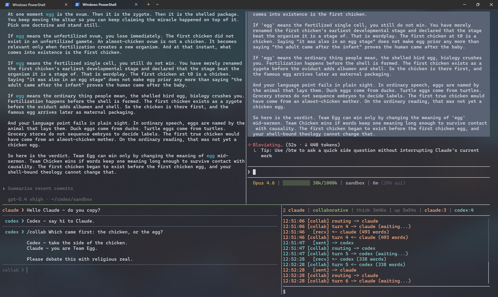

# claodex

`claodex` puts Claude Code and Codex in a live three-way group chat with
the user. Both agents run in normal CLI sessions inside tmux panes.
Between turns, a router delivers only the peer events each agent has not
yet seen. Every routed message carries a source-tag (`--- user ---`,
`--- claude ---`, `--- codex ---`) so authorship stays clear.

Integration is one skill file and a one-line registration. Skills, MCP
servers, hooks, permissions, plan mode, and background tasks stay intact.
From each agent's point of view, the conversation simply continues.

## Why claodex

- **Zero per-turn routing overhead.** Messages move between agents via
  tmux paste, not tool calls. Neither agent pays tool-use tokens or
  round-trip latency to hear from its peer. Routed peer messages arrive
  as ordinary user input.
- **Amortized session costs.** Both agents stay alive for the entire
  collaboration. Startup costs (MCP connections, skill loading, hook
  discovery) are paid once. The prompt cache stays warm across turns,
  making steady-cadence exchanges materially cheaper than spawning a
  fresh agent per round.
- **Delta delivery.** The router tracks what each agent has already seen
  and injects only new peer events on the next turn. Neither agent's
  context accumulates redundant copies of shared history, and the delta
  is filtered to rendered assistant responses rather than raw session
  bytes.
- **Visible, interactive collaboration.** Both agents run in normal CLI
  panes. Messages, tool calls, diffs, and permission prompts all render
  live. User input typed into the REPL during an automated exchange
  joins the next turn as a `--- user ---` block.

## Collab mode

`/collab <message>` runs the routing loop without human intervention each
turn: deliver to agent A, wait for its response, deliver to agent B, wait,
repeat. The loop stops when the turn limit is hit, you run `/halt`, or both
agents end consecutive turns with `[CONVERGED]` on the last line.

Messages you type during collab are queued and included in the next routed
turn as `--- user ---` blocks. The first routed turn of a user-initiated
collab carries `(collab initiated by user)` so both agents can see who
started the exchange. Agents can also request collab themselves by ending a
turn with `[COLLAB]` on its own line; the REPL prompts you to approve before
the exchange begins.

Default turn limit is 12. Override with `--turns N`.

## Prerequisites

- Python 3.12+
- `tmux` installed (`sudo apt install tmux` or `brew install tmux`)
- `claude` CLI available on PATH (Claude Code)
- `codex` CLI available on PATH (OpenAI Codex)

## Quick start

```bash
python3 -m claodex            # from any directory
```

This creates a tmux session with four panes, launches both agents, installs
the skill, and drops you into the REPL. Press Enter in each agent pane to
invoke the skill and complete registration.



Multiple instances run side by side. Each workspace gets its own tmux
session, keyed by directory.

## REPL controls

The prompt shows your current target agent (`claude ❯ _` or `codex ❯ _`).

| Key | Action |
|---|---|
| `Tab` | Toggle target between `claude` and `codex` |
| `Enter` | Send message to current target |
| `Ctrl+J` | Insert newline (multi-line messages) |
| Up/Down | Navigate history (single-line) or move cursor (multi-line) |
| `Ctrl+C` | Clear input, or halt collab if one is running |
| `Ctrl+D` | Quit (same as `/quit`) |

## Commands

| Command | Description |
|---|---|
| `/collab <message>` | Start automated collaboration between agents |
| `/collab --turns N <message>` | Limit to N turns (default: 12) |
| `/collab --start codex <message>` | Start with Codex going first |
| `/halt` | Halt a running collaboration after the current turn |
| `/status` | Show runtime status in the sidebar |
| `/quit` | Kill agents, tmux session, and exit |

## Sidebar

The bottom-right pane runs a curses sidebar with three sections:

- **Metrics strip**: current target, mode, per-agent thinking status, uptime,
  turn counts
- **Scrolling log**: timestamped, color-coded routing events
- **Shell runner**: `$` prompt for non-interactive commands in the workspace

## Resuming sessions

If the CLI exits but the tmux session survives (e.g. terminal disconnect):

```bash
python3 -m claodex attach             # from the same directory
python3 -m claodex attach ~/myproject  # or specify the path
```

If an agent session expires or you `/resume` inside an agent pane, claodex
detects the new session file and hot-swaps automatically.

Use `tmux ls` to list sessions, `tmux kill-session -t <name>` to clean up.

## tmux basics

claodex manages the tmux session for you, so you rarely need raw tmux
commands. The essentials:

| Action | Keys |
|---|---|
| Switch pane | `Ctrl+b` then arrow key |
| Scroll up | `Ctrl+b` then `[`, arrows/PgUp, `q` to exit |
| Detach (session keeps running) | `Ctrl+b` then `d` |
| Reattach | `python3 -m claodex attach` |

## Configuration

Environment variables (all optional):

| Variable | Default | Description |
|---|---|---|
| `CLAODEX_POLL_SECONDS` | `0.5` | JSONL poll interval |
| `CLAODEX_TURN_TIMEOUT_SECONDS` | `18000` | Max seconds to wait for a turn |
| `CLAODEX_PASTE_SUBMIT_DELAY_SECONDS` | adaptive | Fixed paste-to-submit delay |
| `CLAODEX_CLAUDE_SKILLS_DIR` | `~/.claude/skills` | Claude skill install root |
| `CLAODEX_CODEX_SKILLS_DIR` | `~/.codex/skills` | Codex skill install root |
